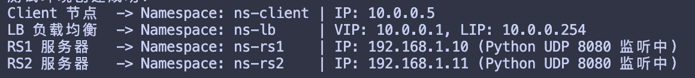
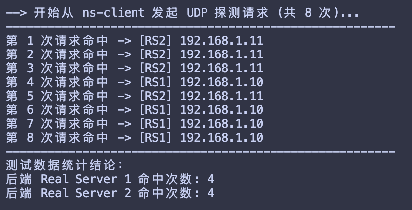
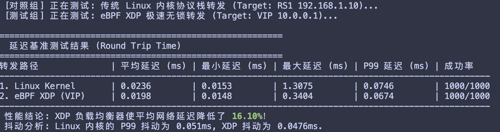

# UDP 负载均衡器

## 项目环境

ubuntu 26.04 64位

## 构建项目

```bash
sudo ./build.sh
```

## 手动分布构建项目

### 内核态程序编译命令

在udp-lb-ebpf目录下执行以下命令，输出目录为target/bpfel-unknown-none/release/udp-lb

```bash
cargo +nightly build --release
```

### 用户态程序编译命令

在udp-lb目录下执行以下命令，输出目录为udp-lb/target/release/udp-lb

```bash
cargo build --release
```

## 测试环境构建以及test

根据config.yaml中配置编写的、使用namespace隔离以及网桥作为连接的测试环境构建脚本，运行命令

```bash
sudo ./setup_env.sh
```



测试lb是否起作用

```bash
sudo ./test_lb.sh
```



测试lb与linux内核协议栈的延迟

```bash
sudo ./benchmark_latency.sh
```




## 项目实验报告

根目录下《基于Xdp实现的udp负载均衡器》实验报告.pdf